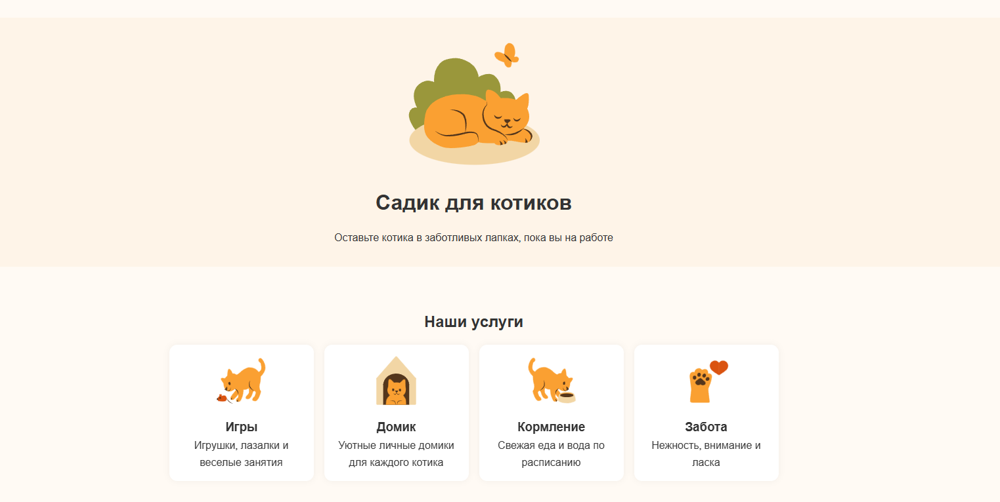
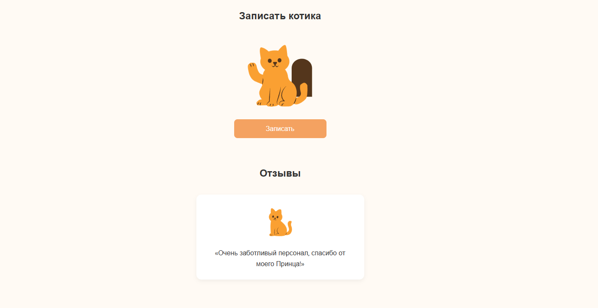
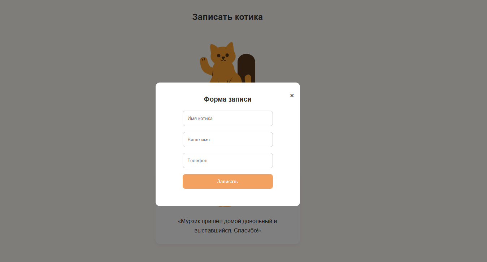
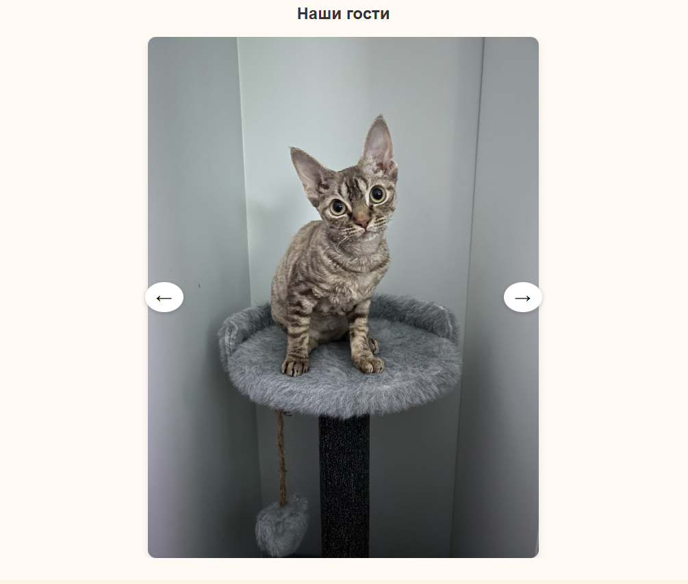
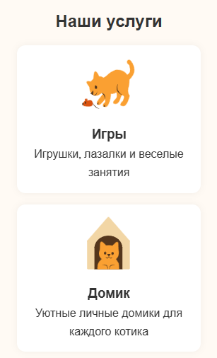
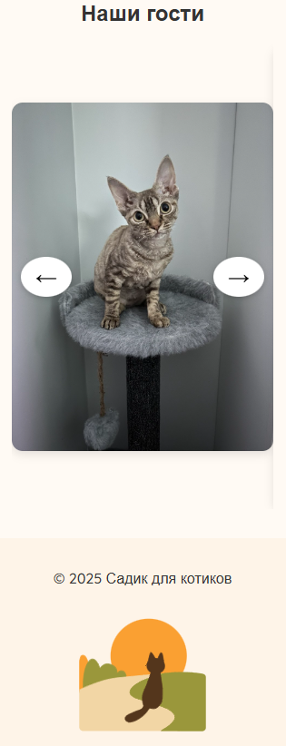

# Сад для котиков

Красивый и удобный **сайт для кошачьего садика**, созданный с использованием **HTML**, **CSS** и **Vanilla JavaScript**. Все иллюстрации были нарисованы мной в Figma специально для этого проекта.

## Оглавление

- [Функциональность](#функциональность)
- [Особенности](#особенности)
- [Структура проекта](#структура-проекта)
- [Как запустить](#как-запустить)
- [Технологии](#технологии)
- [Скриншоты](#скриншоты)
- [Автор](#автор)

## Функциональность

- **Информация об услугах** садика для котиков
- **Форма записи** с валидацией полей:
  - Проверка имени котика и владельца
  - Автоматическое форматирование и валидация номера телефона
- **Модальное окно** для оформления заявки
- **Слайдер с отзывами**, автоматически переключающийся каждые 5 секунд
- **Галерея** с фотографиями гостей садика
- **Адаптивный дизайн**, корректно отображающийся на мобильных устройствах

## Особенности

- Все **иллюстрации** (иконки услуг, фоновые элементы) нарисованы в Figma специально для этого проекта
- Плавные **анимации** при прокрутке (AOS library)
- **Валидация формы** с понятными сообщениями об ошибках
- **Уведомление** об успешной отправке формы

## Структура проекта

- `index.html` - Основная HTML-страница
- `style.css` - Стилизация сайта
- `script.js` - Логика работы слайдеров, модального окна и валидации формы
- `img/` - Папка с изображениями и иллюстрациями
- `screens/` - Папка с изображениями и иллюстрациями
- `README.md` - Документация проекта

## Как запустить

1. Скачайте или клонируйте репозиторий:

   ```
   git clone https://github.com/Ars2805/cat-garden.git
   ```

2. Откройте файл index.html в браузере.

## Технологии

- **HTML5** - Семантическая разметка
- **CSS3** - Стилизация и анимации
- **JavaScript** - Интерактивные элементы
- [AOS Library](https://michalsnik.github.io/aos/) - Анимации при прокрутке
- **Google Fonts** - Шрифт Quicksand
- **Figma** - Отрисовка иллюстраций

## Скриншоты








## Автор

- [Арсения Лушина](https://github.com/Ars2805)